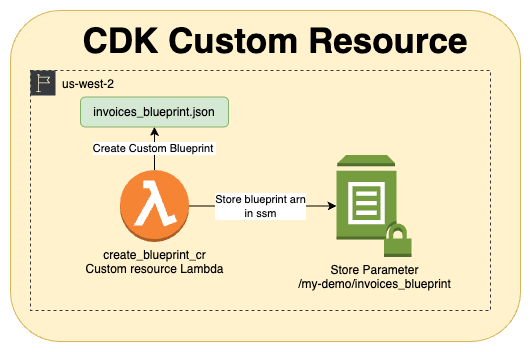
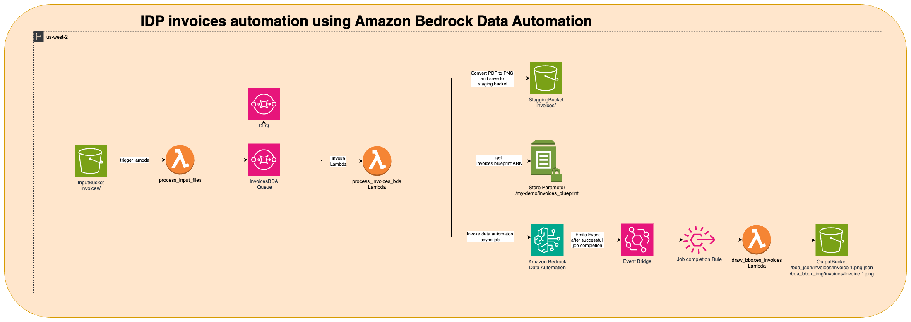

# IDP Invoice Automation using Amazon Bedrock Data Automation

This project implements an Intelligent Document Processing (IDP) solution for invoice automation using AWS Bedrock Data Automation.

The system processes invoices uploaded to an S3 bucket, extracts relevant information using Bedrock Data Automation, and provides annotated results.
It leverages AWS services such as Lambda, S3, SQS, and EventBridge to create a scalable and efficient document processing pipeline.

## Usage Instructions

### Installation

Prerequisites:
- Python 3.12
- AWS CDK CLI
- AWS CLI configured with appropriate credentials

Steps:
1. Clone the repository
2. Navigate to the project directory
3. Create a virtual environment:
   ```
   python -m venv .venv
   ```
4. Activate the virtual environment:
   - On Windows: `.venv\Scripts\activate.bat`
   - On Unix or MacOS: `source .venv/bin/activate`
5. Install dependencies:
   ```
   pip install -r requirements.txt
   ```
6. synthesize the CloudFormation template for this project.
    ```
    cdk synth
    ```

### Deployment

1. Configure the project by editing `project_config.json`
2. Deploy the stack:
   ```
   cdk deploy
   ```

### Processing Invoices

1. Upload sample invoice documents from "sample_invoices" folder to the S3 Input Bucket created by the stack inside 'invoices' directory
2. The system will automatically process the invoices using Bedrock Data Automation
3. Annotated results and extracted data will be available in the output S3 bucket

## Data Flow
1. **Invoice Upload**:
   - A user uploads an invoice file (PDF or other format) to the **Input S3 Bucket** (`invoices/`).

2. **S3 Event Notification**:
   - This triggers the **`process_input_files` Lambda function**.
   - The Lambda function processes the uploaded file and sends an event message to the **`InvoicesBDA Queue` (SQS)**.

3. **Message Handling**:
   - The SQS queue delivers the message to the **`process_invoices_bda` Lambda function**, which starts the invoice processing workflow.

4. **Invoice Processing Workflow**:
   - The `process_invoices_bda` Lambda performs the following actions:
     - **Convert PDF to PNG**: The invoice is converted into PNG format and stored in the **Staging Bucket** (`/staging_bda`).
     - **Retrieve Invoices Blueprint ARN**: It fetches the ARN of the blueprint required for data automation from the **Systems Manager Parameter Store** (`/my-demo/invoices_blueprint`).
     - **Invoke Bedrock Data Automation**: The Lambda function invokes **Amazon Bedrock Data Automation** as an **asynchronous job** to process the invoice.

5. **EventBridge Notification**:
   - Once the Bedrock Data Automation job is completed, it emits an event notification via **Amazon EventBridge**.

6. **Job Completion Rule**:
   - A predefined **Job Completion Rule** in EventBridge triggers the **`draw_bboxes_invoices` Lambda function**.

7. **Annotating Results**:
   - The `draw_bboxes_invoices` Lambda:
     - Annotates the processed invoice with **bounding boxes** (for detected fields or objects) and **confidence scores**.
     - Saves the annotated results to the **Output S3 Bucket** with the following paths:
       - **Extracted Data**: `/bda_json/invoices/invoice1.json`
       - **Annotated Image**: `/bda_bbox_img/invoices/invoice1.png`


## Architecture Diagram

### CDK Custom Resource

The first diagram illustrates the CDK custom resource which triggers a Lambda function to create the BDA blueprint during the initial setup. The Lambda function:
- Checks if a blueprint exists for the document type (e.g., invoices).
- If not, creates the blueprint dynamically for demonstration purposes.
- Stores the created blueprint's ARN in AWS Systems Manager Parameter Store for downstream usage.



### Invoice Processing Pipeline

This architecture automates invoice processing using **Amazon Bedrock Data Automation (BDA)**, integrating AWS services for seamless handling, processing, and annotation of uploaded invoices. It is designed to extract structured data from invoices and store annotated results in a structured format.



The system leverages multiple AWS services to automate the entire invoice processing pipeline. Below is a high-level overview of the architecture:

1. **Input S3 Bucket**: `invoices/`
   - Receives uploaded invoices and triggers processing.

2. **Lambda Functions**:
   - **`process_input_files`**: Handles S3 event notifications and sends data to the SQS queue.
   - **`process_invoices_bda`**: Converts files, invokes Bedrock Data Automation, and manages staging.
   - **`draw_bboxes_invoices`**: Annotates images with bounding boxes and saves results.

3. **Amazon SQS**:
   - Used as a messaging layer between the initial processing Lambda and the Bedrock processing Lambda.

4. **Amazon Bedrock Data Automation**:
   - Performs advanced AI-based data extraction from invoices using blueprints.

5. **EventBridge**:
   - Captures completion events from Bedrock Data Automation and triggers post-processing.

6. **Output S3 Bucket**: `/bda_json/` and `/bda_bbox_img/`
   - Stores extracted data and annotated invoice images for access.

The architecture offers a fully serverless and scalable solution for automating invoice processing using AWS services. It leverages **Amazon Bedrock Data Automation** for advanced AI-based data extraction and annotation, ensuring high accuracy and efficiency. With its modular design, the system handles tasks such as file conversion, blueprint-based data processing, and event-driven workflows seamlessly. It automatically processes uploaded invoices, extracts structured data, and annotates images with bounding boxes and confidence scores, storing results in a structured format within S3 buckets. This approach minimizes manual intervention, provides high reliability, and allows easy integration of additional features or services for enhanced functionality.


## Infrastructure

The project uses AWS CDK to define and deploy the following infrastructure:

- VPC:
  - Public and private subnets
  - S3 VPC Endpoint
- S3 Buckets:
  - Access logs bucket
  - Input bucket
  - Staging bucket
  - Output bucket
- Lambda Functions:
  - create_blueprint_cr
  - draw_bboxes_invoices
  - process_input_files
  - process_invoices_bda
- Lambda Layers:
  - langchain-core-layer
  - pypdfium2-layer
  - pillow-layer
  - boto3-layer
- SQS Queues:
  - InvoicesBDAQueue (with KMS encryption)
  - InvoicesBDADLQ (Dead Letter Queue)
- KMS Key for SQS encryption
- EventBridge rule to trigger downstream lambda
- IAM roles and policies for Lambda functions and other resources

### Baseline performance expectations:
- Invoice processing time: ~30 seconds per page
- End-to-end pipeline execution: <1 minutes per invoice


## Security

See [CONTRIBUTING](CONTRIBUTING.md#security-issue-notifications) for more information.

## License

This library is licensed under the MIT-0 License. See the LICENSE file.